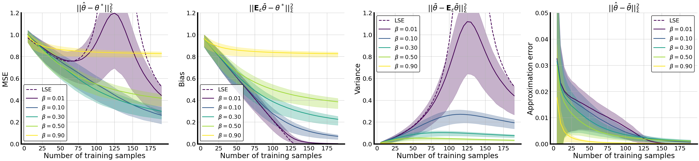

# Understanding Data Augmentation 

Lin, C. H., Kaushik, C., Dyer, E. L., & Muthukumar, V. (2022). The good, the bad and the ugly sides of data augmentation: An implicit spectral regularization perspective. [arXiv preprint arXiv:2210.05021.](https://arxiv.org/abs/2210.05021)

#### Why data augmentation?
Data augmentation (DA) is a powerful workhorse for bolstering performance in modern machine
learning. Specific augmentations like translations and scaling in computer vision are traditionally
believed to improve generalization by generating new (artificial) data from the same distribution.
However, this traditional viewpoint does not explain the success of prevalent augmentations
in modern machine learning (e.g. randomized masking, cutout, mixup), that greatly alter the
training data distribution. In this work, we develop a new theoretical framework to characterize
the impact of a general class of DA on underparameterized and overparameterized linear model
generalization. Our framework reveals that DA induces implicit spectral regularization through a
combination of two distinct effects: a) manipulating the relative proportion of eigenvalues of
the data covariance matrix in a training-data-dependent manner, and b) uniformly boosting
the entire spectrum of the data covariance matrix through ridge regression. These effects,
when applied to popular augmentations, give rise to a wide variety of phenomena, including
discrepancies in generalization between over-parameterized and under-parameterized regimes and
differences between regression and classification tasks. Our framework highlights the nuanced
and sometimes surprising impacts of DA on generalization, and serves as a testbed for novel
augmentation design.

#### Effect of data augmentation for linear models
We show that DA induces two primary effects impacting the model generalization: **1. L2 regularization with an intensity equal to the number of training samples** and **2. data spectrum manipulations**. Below, in the left figure, we show the modified data spectrum by random rotation augmentation, while in the right, we record the bias/variance distributions for three kinds of different augmentations, ranging from Gaussian noise injection (N), random mask (M), to random rotations (R).

 

#### New generalization decomposition
Compared to traditional empirical risk minimization analysis, the generalization analysis requires analyzing a data-dependant regularizer.
Hence, we propose to decompose the MSE into Bias-Variance-Approx.Error to facilitate the generalization analysis. The approximation error comes from the error of approximating the random regularizer induced by data augmentation with a deterministic matrix. The below figure shows that the approximation error' scale is negligible compared with bias and variance.


## Citation
If you find the code useful for your research, please consider citing our work:

```
@{lin2021,
  title = 	 {The good, the bad and the ugly sides of data augmentation:
An implicit spectral regularization perspective},
  author =       {Chi-Heng Lin, Chiraag Kaushik, Eva L. Dyer, & Vidya Muthukumar},
}
```

#### Contributers
This project was developed by [Chi-Heng Lin](https://github.com/uldyssian2008), Chiraag Kaushik, [Eva L. Dyer](https://github.com/nerdslab) and Vidya Muthukumar at Georgia Tech.
